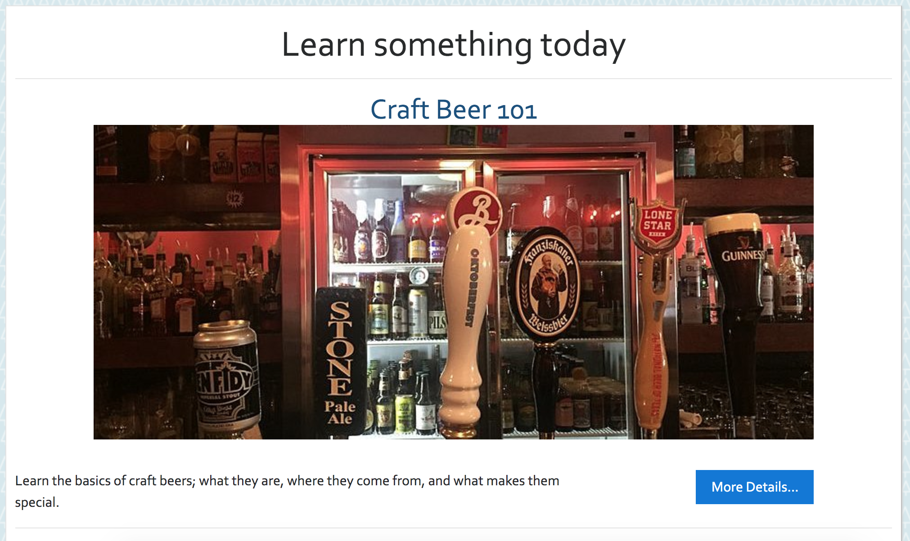
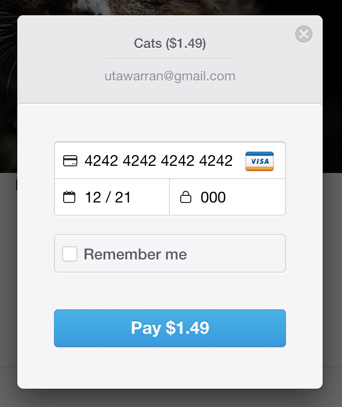
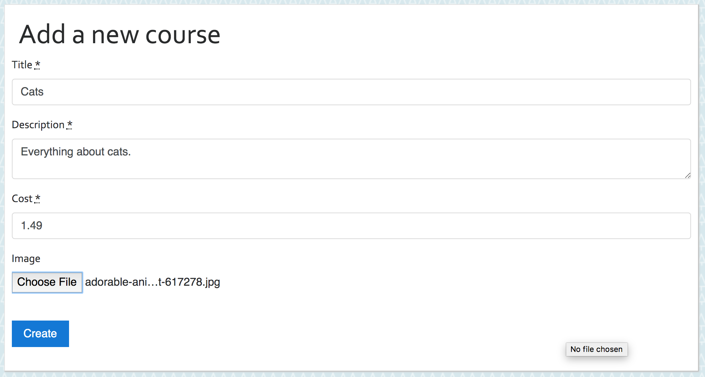
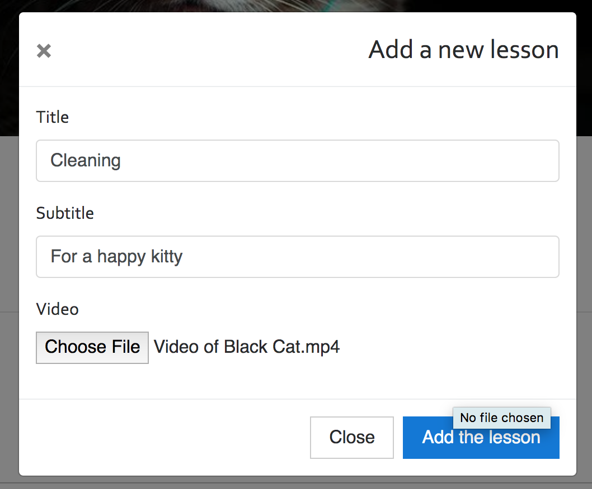

# About Flixter

A two-sided, video-streaming marketplace platform that features credit card payment capabilities, user role management, complex user interfaces, and advanced database relationships.

## How to Use

In order to fully interact with the application, sign in or sign up with an email account. Once signed in, you are able to see any courses that you are teaching or enrolled in by clicking on *My Dashboard* on the top right corner.

### Enroll in a Course 

To enroll in a course, click either on *Learn More* on the homepage, or *See All Courses* on the navbar. All courses will be listed with pictures and descriptions.

Select any course by clicking on its title or on *More Details..*.

Because the application is currently on testing mode, to enroll in a course click on *Pay With Card* and fill out payment with this information:

Now you are able to access all lessons from that course.

If you are the teacher, click on *Administer* to add or edit that course.

### Teach a Course

To teach a course, go to the footer and click on *Teach a Course* under the **Teachers** column.

Fill out all the information for the course and add an image.

Click on *Add a new section...* and choose a title for your first lesson. Then click on *New Lesson* and fill out all the information and add a video.

If you want to see your lesson from your students' points of view, click on *Preview as student*.

You are able to switch the order of the sections and lessons around at any time.

## Credits

* **The Coding Bootcamp** - *University of Texas - Austin* - [Course Link](https://techbootcamps.utexas.edu/coding/online/landing/?tc_ver=1&s=Google-Brand&pkw=ut%20austin%20coding%20bootcamp&pcrid=397231697230&pmt=e&utm_source=google&utm_medium=cpc&utm_campaign=GGL%7CUT-Austin%7CSEM%7CCODING%7C-%7CONL%7CTIER-1%7CALL%7CBRD%7CEXACT%7CCore%7CBootcamp&utm_term=ut%20austin%20coding%20bootcamp&utm_content=397231697230&s=google&k=ut%20austin%20coding%20bootcamp&gclid=EAIaIQobChMI16eEysjL5wIVh5OzCh03vAWNEAAYASAAEgKc8PD_BwE&gclsrc=aw.ds)

* *Rosy Arreola* - [Homepage](https://rosyarreola.netlify.com/)